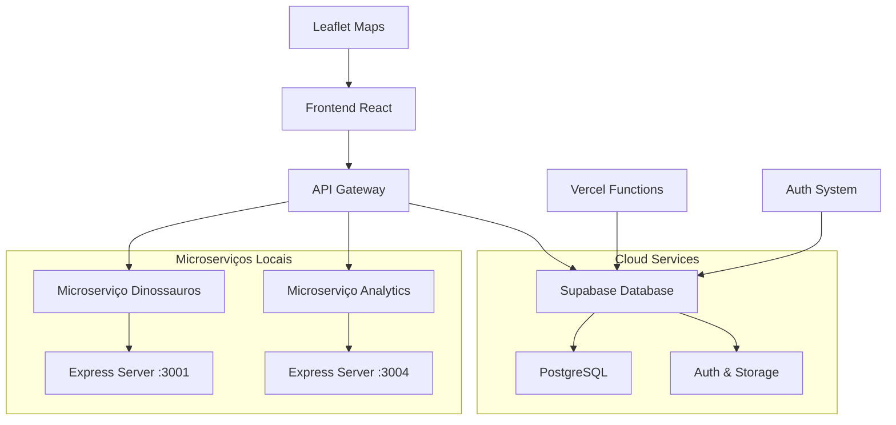

# 🦕 Dino Library

<div align="center">


**Uma experiência imersiva de aprendizado sobre dinossauros através de descobertas arqueológicas, mapas interativos e educação científica.**

[](https://vercel.com)
[](https://reactjs.org/)
[](https://www.typescriptlang.org/)
[](https://supabase.com/)

[Demo Live](https://dino-library.vercel.app) • [Reportar Bug](https://github.com/ensinho/dino-library/issues) • [Solicitar Feature](https://github.com/ensinho/dino-library/issues)

</div>

---

## 🌟 Features Principais

### 🔍 **Catálogo Interativo de Espécies**
- **Base de dados completa** com mais de 500 espécies de dinossauros
- **Filtros avançados** por período geológico, dieta e localização
- **Sistema de busca inteligente** com pesquisa em tempo real
- **Paginação otimizada** para navegação eficiente
- **Cards informativos** com detalhes científicos completos

### 🗺️ **Mapas Arqueológicos Interativos**
- **Visualização geográfica** dos locais de descoberta de fósseis
- **Integração com Leaflet** para mapas dinâmicos e responsivos
- **Marcadores personalizados** para cada sítio arqueológico
- **Informações detalhadas** sobre cada descoberta

### ⏰ **Timeline Evolutiva**
- **Linha do tempo interativa** das descobertas paleontológicas
- **Visualização cronológica** dos períodos geológicos
- **Marcos históricos** da paleontologia mundial

### 🎓 **Centro Educacional**
- **Quizzes interativos** para testar conhecimentos
- **Conteúdo educativo** sobre paleontologia
- **Experiências de aprendizado gamificadas**

### 👤 **Sistema de Autenticação e Perfil**
- **Login/Cadastro seguro** via Supabase Auth
- **Perfis personalizados** com histórico de atividades
- **Progresso de aprendizagem** salvo na nuvem

## 🚀 Tecnologias Utilizadas

### **Frontend**
- **React 18.3.1** - Framework principal para UI
- **TypeScript 5.8.3** - Tipagem estática para maior robustez
- **Vite 5.4.19** - Build tool ultra-rápido
- **React Router DOM 6.30.1** - Roteamento SPA
- **TanStack Query 5.83.0** - Gerenciamento de estado e cache

### **UI/UX & Styling**
- **Tailwind CSS 3.4.17** - Framework CSS utilitário
- **Radix UI** - Componentes acessíveis e customizáveis
- **Lucide React** - Biblioteca de ícones moderna
- **Class Variance Authority** - Variantes de componentes tipadas
- **Framer Motion** (via Tailwind Animate) - Animações fluidas

### **Mapas & Visualização**
- **Leaflet 1.9.4** - Mapas interativos
- **React Leaflet 4.2.1** - Integração React + Leaflet
- **Turf.js 7.2.0** - Análises geoespaciais
- **Recharts 2.15.4** - Gráficos e visualizações de dados

### **Backend & Database**
- **Supabase** - Backend-as-a-Service completo
- **PostgreSQL** - Database relacional via Supabase
- **Vercel Functions** - Serverless API endpoints
- **Deno Runtime** - Runtime JavaScript moderno para APIs

### **Arquitetura de Microserviços**
- **Express.js** - Serviços independentes
- **Node.js** - Runtime para microserviços
- **API Gateway personalizado** - Roteamento e fallbacks
- **Health Check system** - Monitoramento de serviços

### **Internacionalização**
- **i18next 25.5.2** - Sistema de traduções
- **Suporte a 3 idiomas**: Português, Inglês e Espanhol
- **Detecção automática** de idioma do navegador

### **Ferramentas de Desenvolvimento**
- **ESLint 9.32.0** - Linting de código
- **PostCSS 8.5.6** - Processamento de CSS
- **Autoprefixer** - Compatibilidade CSS cross-browser

## 🏗️ Arquitetura do Sistema



## 📦 Instalação e Configuração

### **Pré-requisitos**
- Node.js 18+ ou Bun
- Git
- Conta no Supabase

### **1. Clone o repositório**
```bash
git clone https://github.com/ensinho/dino-library.git
cd dino-library
```

### **2. Instale as dependências**
```bash
# Com npm
npm install

# Ou com bun (recomendado)
bun install
```

### **3. Configure as variáveis de ambiente**
```bash
# Copie o arquivo de exemplo
cp .env.example .env

# Configure suas variáveis no arquivo .env
VITE_SUPABASE_URL=sua_url_do_supabase
VITE_SUPABASE_ANON_KEY=sua_chave_anonima
VITE_USE_LOCAL_SERVICES=true
VITE_ENABLE_ANALYTICS=true
```

### **4. Configure o banco de dados**
```bash
# Execute as migrações do Supabase
npx supabase db reset
```

### **5. Inicie os microserviços (opcional)**
```bash
# Windows
.\start-microservices.bat

# Linux/Mac
./start-microservices.sh

# Ou manualmente
cd microservices
npm run start:services
```

### **6. Inicie o servidor de desenvolvimento**
```bash
npm run dev
# ou
bun dev
```

A aplicação estará disponível em `http://localhost:5173`

## 🔧 Scripts Disponíveis

```bash
npm run dev          # Servidor de desenvolvimento
npm run build        # Build para produção
npm run preview      # Preview do build de produção
npm run lint         # Executar ESLint
npm run vercel-build # Build otimizado para Vercel
```

## 📊 Estrutura do Projeto

```
dino-library/
├── 📁 api/                     # Vercel Serverless Functions
│   ├── 📁 dinosaurs/          # API de dinossauros
│   └── 📁 analytics/          # API de analytics
├── 📁 microservices/          # Microserviços locais
│   ├── 📁 dinosaur-service/   # Serviço de dinossauros
│   └── 📁 analytics-service/  # Serviço de analytics
├── 📁 src/
│   ├── 📁 components/         # Componentes React
│   │   ├── 📁 ui/            # Componentes de UI base
│   │   └── 📁 layout/        # Componentes de layout
│   ├── 📁 pages/             # Páginas da aplicação
│   ├── 📁 services/          # Serviços e APIs
│   ├── 📁 hooks/             # Custom React Hooks
│   ├── 📁 lib/               # Utilitários e configurações
│   └── 📁 integrations/      # Integrações externas
├── 📁 public/
│   └── 📁 locales/           # Arquivos de tradução
└── 📁 supabase/              # Configurações do Supabase
    └── 📁 migrations/        # Migrações do banco
```

## 🌐 Deploy

### **Vercel (Recomendado)**
1. Conecte seu repositório ao Vercel
2. Configure as variáveis de ambiente
3. Deploy automático a cada push

### **Outros provedores**
```bash
# Build para produção
npm run build

# A pasta 'dist' contém os arquivos para deploy
```

## 🤝 Contribuição

Contribuições são sempre bem-vindas! Para contribuir:

1. Fork o projeto
2. Crie uma branch para sua feature (`git checkout -b feature/AmazingFeature`)
3. Commit suas mudanças (`git commit -m 'Add some AmazingFeature'`)
4. Push para a branch (`git push origin feature/AmazingFeature`)
5. Abra um Pull Request

## 📈 Roadmap

- [ ] **Sistema de favoritos** para dinossauros
- [ ] **Realidade aumentada** para visualização 3D
- [ ] **API pública** para desenvolvedores
- [ ] **Sistema de conquistas** gamificado
- [ ] **Modo offline** com PWA
- [ ] **Integração com museus** parceiros

## 📄 Licença

Este projeto está sob a licença MIT. Veja o arquivo [LICENSE](LICENSE) para mais detalhes.

## 👨‍💻 Autor

**Enzo Esmeraldo**

- GitHub: [@ensinho](https://github.com/ensinho)
- LinkedIn: [Enzo Esmeraldo](https://www.linkedin.com/in/enzoesmeraldo)
- Email: enzopo625@gmail.com

---

<div align="center">

**Feito com ❤️ por [Enzo Esmeraldo](https://github.com/ensinho)**

⭐ **Se este projeto te ajudou, considere dar uma estrela!**

</div>