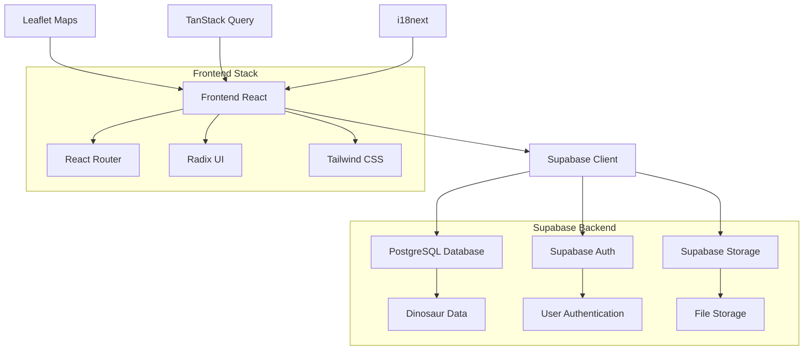

# 🦕 Dino Library

<div align="center">


**An immersive learning experience about dinosaurs through archaeological discoveries, interactive maps and scientific education.**

[](https://vercel.com)
[](https://reactjs.org/)
[](https://www.typescriptlang.org/)
[](https://supabase.com/)

[Live Demo](https://dino-library.vercel.app) • [Report Bug](https://github.com/ensinho/dino-library/issues) • [Request Feature](https://github.com/ensinho/dino-library/issues)

</div>

---

## 🌟 Key Features

### 🔍 **Interactive Species Catalog**
- **Complete database** with over 500 dinosaur species
- **Advanced filters** by geological period, diet and location
- **Smart search system** with real-time search via Supabase
- **Optimized pagination** for efficient navigation
- **Informative cards** with complete scientific details
- **Intelligent caching** for better performance

### 🗺️ **Interactive Archaeological Maps**
- **Geographic visualization** of fossil discovery sites
- **Leaflet integration** for dynamic and responsive maps
- **Custom markers** for each archaeological site
- **Detailed information** about each discovery

### ⏰ **Evolutionary Timeline**
- **Interactive timeline** of paleontological discoveries
- **Chronological visualization** of geological periods
- **Historical milestones** of world paleontology

### 🎓 **Educational Center**
- **Interactive quizzes** to test knowledge
- **Educational content** about paleontology
- **Gamified learning experiences**

### 👤 **Authentication and Profile System**
- **Secure login/signup** via Supabase Auth
- **Personalized profiles** with activity history
- **Learning progress** saved in the cloud

## 🚀 Technologies Used

### **Frontend**
- **React 18.3.1** - Main framework for UI
- **TypeScript 5.8.3** - Static typing for greater robustness
- **Vite 5.4.19** - Ultra-fast build tool
- **React Router DOM 6.30.1** - SPA routing
- **TanStack Query 5.83.0** - State management and caching

### **UI/UX & Styling**
- **Tailwind CSS 3.4.17** - Utility CSS framework
- **Radix UI** - Accessible and customizable components
- **Lucide React** - Modern icon library
- **Class Variance Authority** - Typed component variants
- **Framer Motion** (via Tailwind Animate) - Smooth animations

### **Maps & Visualization**
- **Leaflet 1.9.4** - Interactive maps
- **React Leaflet 4.2.1** - React + Leaflet integration
- **Turf.js 7.2.0** - Geospatial analysis
- **Recharts 2.15.4** - Charts and data visualizations

### **Backend & Database**
- **Supabase** - Complete Backend-as-a-Service
- **PostgreSQL** - Relational database via Supabase
- **Supabase Auth** - Integrated authentication system
- **Supabase Storage** - File storage

### **Internationalization**
- **i18next 25.5.2** - Translation system
- **Support for 3 languages**: Portuguese, English and Spanish
- **Automatic detection** of browser language

### **Development Tools**
- **ESLint 9.32.0** - Code linting
- **PostCSS 8.5.6** - CSS processing
- **Autoprefixer** - Cross-browser CSS compatibility

## 🏗️ System Architecture



## 📦 Installation and Setup

### **Prerequisites**
- Node.js 18+ or Bun
- Git
- Supabase account

### **1. Clone the repository**
```bash
git clone https://github.com/ensinho/dino-library.git
cd dino-library
```

### **2. Install dependencies**
```bash
# With npm
npm install

# Or with bun (recommended)
bun install
```

### **3. Configure environment variables**
```bash
# Copy the example file
cp .env.example .env

# Configure your variables in the .env file
VITE_SUPABASE_URL=your_supabase_url
VITE_SUPABASE_ANON_KEY=your_anonymous_key
VITE_ENABLE_ANALYTICS=true
```

### **4. Configure the database**
```bash
# Run Supabase migrations
npx supabase db reset
```

### **5. Start the development server**
```bash
npm run dev
# or
bun dev
```

The application will be available at `http://localhost:5173`

## 🔧 Available Scripts

```bash
npm run dev          # Development server
npm run build        # Production build
npm run preview      # Preview production build
npm run lint         # Run ESLint
npm run vercel-build # Optimized build for Vercel
```

## 📊 Project Structure

```
dino-library/
├── 📁 src/
│   ├── 📁 components/         # React components
│   │   ├── 📁 ui/            # Base UI components
│   │   └── 📁 layout/        # Layout components
│   ├── 📁 pages/             # Application pages
│   ├── 📁 services/          # Services and APIs
│   ├── 📁 hooks/             # Custom React Hooks
│   ├── 📁 lib/               # Utilities and configurations
│   └── 📁 integrations/      # External integrations
├── 📁 public/
│   └── 📁 locales/           # Translation files
└── 📁 supabase/              # Supabase configurations
    └── 📁 migrations/        # Database migrations
```

## 🌐 Deployment

### **Vercel (Recommended)**
1. Connect your repository to Vercel
2. Configure environment variables
3. Automatic deployment on every push

### **Other providers**
```bash
# Build for production
npm run build

# The 'dist' folder contains files for deployment
```

## 🤝 Contributing

Contributions are always welcome! To contribute:

1. Fork the project
2. Create a branch for your feature (`git checkout -b feature/AmazingFeature`)
3. Commit your changes (`git commit -m 'Add some AmazingFeature'`)
4. Push to the branch (`git push origin feature/AmazingFeature`)
5. Open a Pull Request

## 📈 Roadmap

- [ ] **Favorites system** for dinosaurs
- [ ] **Augmented reality** for 3D visualization
- [ ] **Public API** for developers
- [ ] **Gamified achievement system**
- [ ] **Offline mode** with PWA
- [ ] **Partner museum integration**

## 📄 License

This project is under the MIT license. See the [LICENSE](LICENSE) file for more details.

## 👨‍💻 Author

**Enzo Esmeraldo**

- GitHub: [@ensinho](https://github.com/ensinho)
- LinkedIn: [Enzo Esmeraldo](https://www.linkedin.com/in/enzoesmeraldo)
- Email: enzopo625@gmail.com

---

<div align="center">

**Made with ❤️ by [Enzo Esmeraldo](https://github.com/ensinho)**

⭐ **If this project helped you, consider giving it a star!**

</div>